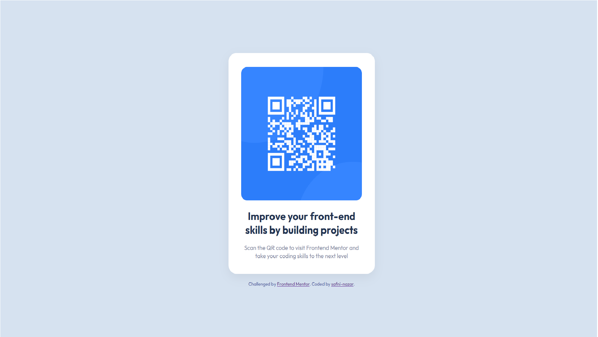

# Frontend Mentor - QR code component solution

This is a solution to the [QR code component challenge on Frontend Mentor](https://www.frontendmentor.io/challenges/qr-code-component-iux_sIO_H). Frontend Mentor challenges help you improve your coding skills by building realistic projects. 

**Note: Delete this note and update the table of contents based on what sections you keep.**

## Overview

### Screenshot




- Live Site URL: [url]()


### Built with

- Semantic HTML5 markup
- CSS custom properties
- Flexbox

### What I learned

Use this section to recap over some of your major learnings while working through this project. Writing these out and providing code samples of areas you want to highlight is a great way to reinforce your own knowledge.

To see how you can add code snippets, see below:

```html
<h1>I'm proud of myself!</h1>
```
```css
.proud-of-this-css {
  color: papayawhip;
}
```
```js
const proudOfThisFunc = () => {
  console.log('😌❤')
}
```

## Author

- Website - [Add your name here](https://qrcodecomponent-sha.netlify.app/)
- Frontend Mentor - [@yourusername](https://www.frontendmentor.io/profile/shafni50)
- Twitter - [@yourusername](https://www.twitter.com/shafni50)
